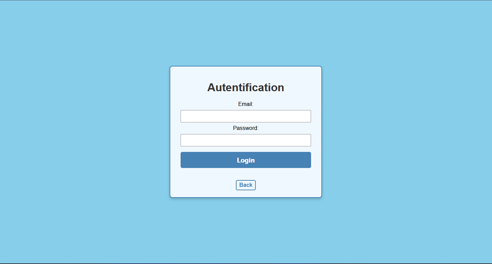
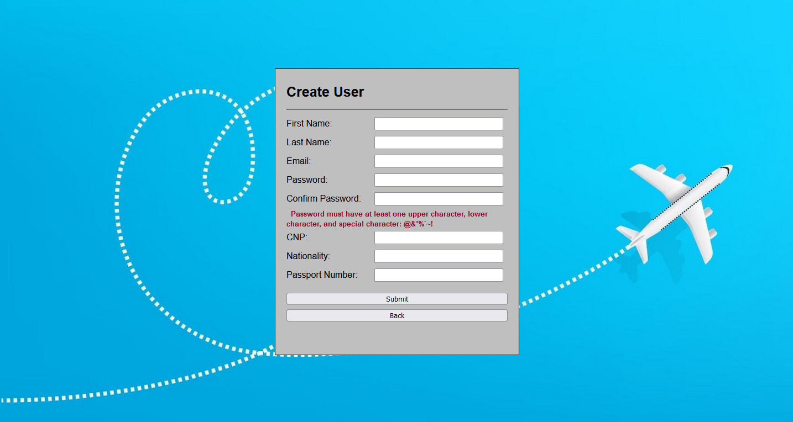
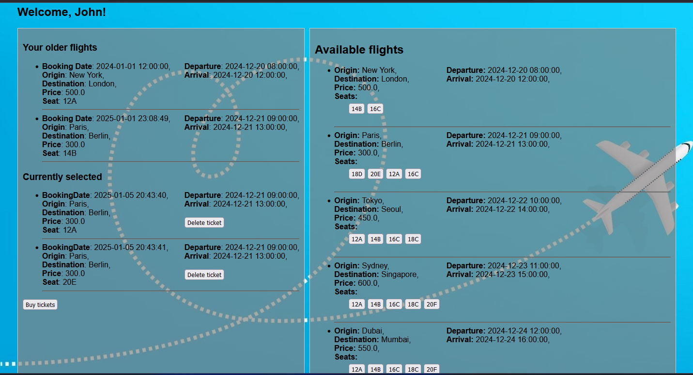

## Overview  
AWJ is a web application for purchasing airline tickets, built with Java Spring, MySQL, and Thymeleaf. It offers an intuitive interface for users to search for flights, select seats, and complete bookings.

## Features  
- 🛫 **Flight browsing** with real-time seat availability  
- 🛒 **Shopping cart** for multiple ticket selections  
- 🔐 **Secure checkout** process for ticket purchases  
- 📜 **Booking history** and ticket management  
- 👤 **User authentication** and account management  

## Technologies Used  
- **Backend:** Java Spring Boot  
- **Frontend:** Thymeleaf, HTML, CSS, JavaScript  
- **Database:** MySQL  
- **Other:** Maven, Hibernate, Spring Security  

## Installation  

### Prerequisites  
- Java 17+  
- Maven  
- MySQL  

## 🏠 Home Page  

The home page contains two main options:  

- **Login** – Redirects to the user authentication page.  
- **Create User** – Navigates to the user registration page.

  

## 🔑 Authentication  

The login page requires users to enter:  

- **Email** – The email address associated with the account.  
- **Password** – The account password.  

It includes:  

- A **verification button** to check login credentials.  
- A **back button** to return to the home page.  
- If the email or password is incorrect or not found in the database, an error message **"Incorrect Email/Password!"** will be displayed.

## 🆕 Create User  

The user registration page includes the following fields with validation rules:  

- **First Name** – Must start with a letter and be at least **3 characters long**. It may contain **apostrophes ('), hyphens (-), or spaces** (e.g., O'Conner, Mary-Jane).  
- **Last Name** – Same rules as First Name.  
- **Email** – Must start with a **letter**, followed by numbers, letters, or special characters (`+ . -`).  
- **Password** – Must be at least **5 characters long**, including **one uppercase letter, one lowercase letter, and one special character** (`@ & * % ' ~`).  
- **Confirm Password** – Must match the previously entered password.  
- **Nationality** – No restrictions.  
- **Passport Number** – No restrictions.  

### 📌 Buttons:  
- **Submit** – Validates the information and, if correct, adds the user to the database.  
- **Back** – Returns to the home page.  
- **Access Account** – Becomes visible only after the user is successfully registered, allowing access to the user menu.

## 📋 Menu Page  

The menu page displays user-related flight information, including:  

- **Previous Bookings** – Shows past flight reservations.  
- **Available Flights** – Displays current flights with unoccupied seats.  

For each flight ticket (booked or available), the following details are shown:  

- **Origin**  
- **Destination**  
- **Departure Date & Time**  
- **Arrival Date & Time**  
- **Price**  
- **Seat** – Shows all available seats for possible flights, or the assigned seat for booked tickets.  
- **Booking Date** – The date the ticket was purchased.

